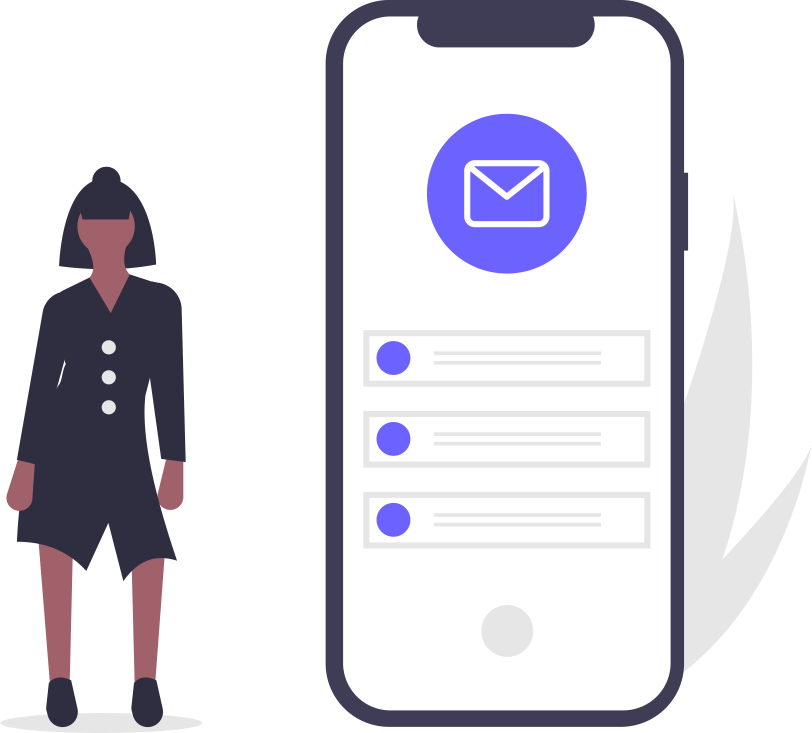

Many of us use apps every day. But we don’t often stop to think: how do apps even work?

In this video I’ll be digging into how apps work to connect people with things they value, and how that works for your business. I’ll talk about app development, the cloud, the app stores, and some other technical stuff – but we are going to be keeping it light on the jargon.

It’s the first video in my series “How do I build an app?”

Let’s dive in.

Apps seem simple when you look at them! But we know companies like Facebook and Google; Twitter and Snapchat have hundreds, even thousands of people working on apps.

When I tap this icon on my phone the Twitter app opens up. But all those engineers working on code at Twitter headquarters: where does that code go? What about even a simple app like the notes app that comes with my phone?

The answer of course is that even a simple app is more than just the icon and the application itself on your phone. Much of the functionality of apps is actually in the cloud.

He is an example of the lifecycle of an app:

- Alice downloads the Zombo app from the App Store to her phone; and
- once installed the app communicates over the Internet so Alice can
  - log in to the Zombo store
  - fetch special offers,
  - save her favourites or
  - share with friends

We already know how to use the web on our phone to connect to a website to look at for example special offers. There can be hundreds and thousands of different links and features and menus on a website that we can easily access using our phone or tablet by browsing and clicking or tapping on what we want.

But how does an app do that?

The answer is something called an API. This stands for Application Programming Interface.

Each link and feature and menu and special offer on the website has to be specifically detailed so that the app can know how to access it. These APIs have to be specified in advance because once the app is built and uploaded to the phone it can’t adapt to changes.
