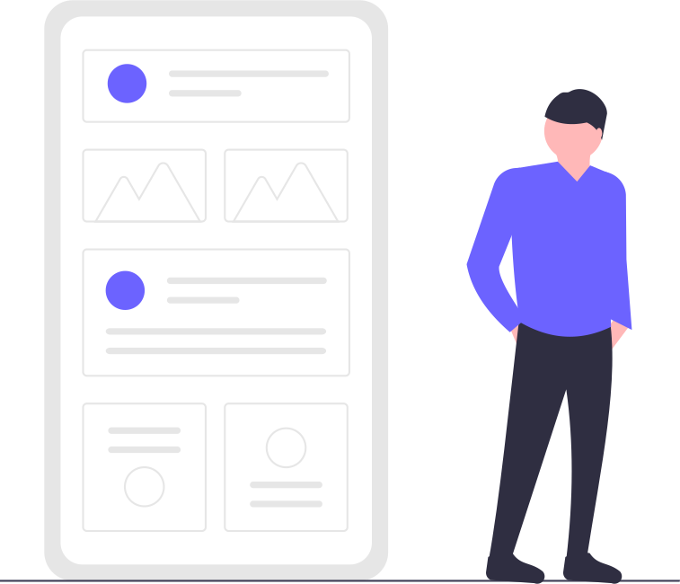

Have you ever wondered what goes into building an app?

What different kinds of apps are there?

## How can I get an app built?

Keep listening to find out the answers to these questions and all your other questions about apps.

I’m Sarah Smith and I have been working with apps for over 20 years. I worked for Google and Nokia and then began building apps for start-ups. I’ve been a start-up CTO Chief Technical Officer (you may have some people watching who don’t know what a CTO is) and I’ve coached start-ups. I’ve built my own apps. It’s tough!

The good news is you can succeed with your app (or ‘The good news is you can build a successful app’ or ‘The good news is you can engage someone to build you a successful app’) without a lot of technical knowledge.

The most important thing is a good understanding of your business. This is true even if you plan for your business to flow from your app after it’s the app is built. So if you understand your business that’s already a great start.

From there you need to know how apps work to connect your customers to your business.

Apps seem simple. You probably have some favourite apps. But what does it mean to have an app built? How do they get into the App Store or Google play store? And what if you want to change it after it’s done?

That’s what we’ll cover, and more, in this series of videos.

## Video Series

In this series I’ll cover the mistakes that new app entrepreneurs make - and how you can avoid them. I’ll show you how to succeed in getting your first app built. And I’ll unpack the best business strategies for making your app a success.

Video 1: How do apps work?

Video 2: what kinds of apps are there?

Video 3: how do you build an app?

Video 4: how do I make money from my app?

Video 5: how does my app work with my business?

Video 6: how do I harness the power of apps?
